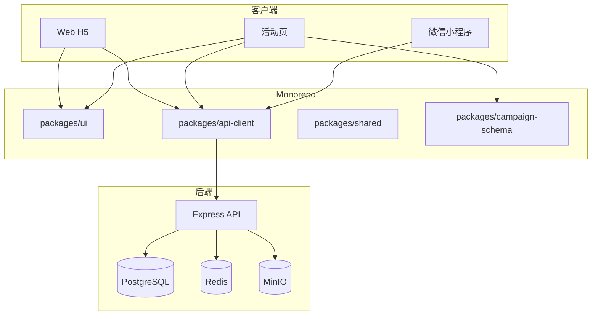

# 拾光市集

面向年轻用户的「内容种草 + 轻电商」C 端练手项目。

## 环境要求

- Node.js 20+
- Docker & Docker Compose
- npm 10+
- 微信开发者工具（小程序开发，可选）

## 快速开始

### 1. 安装依赖

```bash
npm install
```

### 2. 配置环境变量

```bash
cp .env.example .env
```

### 3. 启动基础设施

```bash
docker compose -f infra/docker-compose.yml up -d
```

### 4. 数据库迁移与种子数据

```bash
npm --workspace=api run migrate
npm --workspace=api run seed
```

种子数据包含：6 位作者、8 个商品、60 篇帖子、618 活动页（`618-sale`），以及 E2E 测试账号 `13900000001`。

### 5. 启动开发服务

```bash
npm run dev
```

| 服务 | 地址 |
|------|------|
| Web 前端 | http://localhost:5173 |
| 活动页 | http://localhost:5174 |
| API | http://localhost:3000 |
| API 文档 (Swagger) | http://localhost:3000/api/docs |
| 健康检查 | http://localhost:3000/api/health |

### 6. 微信小程序（可选）

```bash
npm run dev:mini-program
```

用微信开发者工具打开 `apps/mini-program` 目录。详见 [docs/mini-program.md](./docs/mini-program.md)。

## 架构概览



## 项目结构

```
shiguang-market/
├── apps/
│   ├── api/            # Express 5 后端
│   ├── web/            # React 主站 H5
│   ├── campaign/       # 活动页
│   └── mini-program/   # Taro 微信小程序
├── packages/
│   ├── shared/         # 前后端共享类型
│   ├── api-client/     # API 请求封装
│   ├── ui/             # Web 组件库
│   └── ui-taro/        # 小程序 UI 薄封装
├── e2e/                # Playwright E2E 测试
└── infra/
    ├── docker-compose.yml
    └── migrations/
```

## 常用命令

| 命令 | 说明 |
|------|------|
| `npm run dev` | 并行启动 api + web + campaign + Storybook |
| `npm run dev:mini-program` | 编译微信小程序（Taro watch） |
| `npm test` | 运行单元测试 + API 集成测试 |
| `npm run test:e2e` | Playwright E2E（需先 migrate + seed） |
| `npm --workspace=api run migrate` | 执行数据库迁移 |
| `npm --workspace=api run seed` | 填充种子数据 |
| `docker compose -f infra/docker-compose.yml down` | 停止基础设施 |

## 测试

### 单元 & 集成测试

```bash
# 需 PostgreSQL + Redis 运行
npm test
```

集成测试覆盖 auth、feed、order 核心路径（supertest）。无数据库时自动跳过。

### E2E 测试

```bash
npm run test:e2e
```

覆盖 Web 购物链路（登录 → Feed → 详情 → 加购 → 下单 → 支付）与活动页冒烟。

## 技术亮点

1. **Feed 性能**：双列瀑布流视口虚拟化 + 游标分页 + Redis 热点缓存
2. **交易可靠性**：`SELECT FOR UPDATE` 事务锁库存，订单状态机
3. **活动配置化**：Schema 版本化发布，支持灰度与回滚
4. **Monorepo 跨端**：`packages/ui` 统一组件，Web / 小程序复用 api-client
5. **可观测性**：埋点、Web Vitals、Sentry 错误监控
6. **工程质量**：OpenAPI 文档、集成测试、Playwright E2E、CI 门禁

## 文档

| 文档 | 说明 |
|------|------|
| [IMPLEMENTATION_PLAN.md](./IMPLEMENTATION_PLAN.md) | 完整实施计划 |
| [docs/api.md](./docs/api.md) | API 手写文档 |
| `/api/docs` | OpenAPI 3 + Swagger UI（运行时） |
| [docs/performance-report.md](./docs/performance-report.md) | 性能优化报告 |
| [docs/production-checklist.md](./docs/production-checklist.md) | 生产部署清单 |
| [docs/mini-program.md](./docs/mini-program.md) | 小程序开发指南 |

## 阶段进度

当前完成 **阶段 10：测试、文档与收尾**。详见 [IMPLEMENTATION_PLAN.md](./IMPLEMENTATION_PLAN.md)。

### 阶段 10 验收

1. `npm test` 通过（含 auth / feed / order 集成测试）
2. `npm run test:e2e` 通过（购物链路 + 活动页冒烟）
3. 访问 http://localhost:3000/api/docs 查看 API 文档
4. `docker compose up` + `migrate` + `seed` 可复现完整环境
